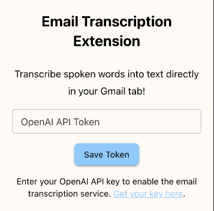
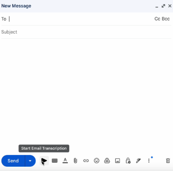

# Email Transcription Extension v2.0 🎤✉️

## Description
The Email Transcription Extension is a next-generation Chrome extension that revolutionizes email composition in Gmail. Using advanced AI-powered speech-to-text technology, it provides a **seamless, single-click experience** for dictating emails with instant customization options.

**✨ What's New in v2.0:**
- **One-click recording** with floating popup interface
- **Instant customization** - no waiting for processing to complete
- **Smart email formatting** with tone and style options
- **Streamlined UX** - from recording to insertion in under 30 seconds
- **Non-intrusive design** - no more disruption to your compose window

## Key Features
- **🎯 One-Click Voice Recording:** Single button starts recording with modern popup interface
- **⚡ Instant Customization:** Immediate access to recipient, tone, and style options while audio processes
- **🧠 Smart AI Processing:** OpenAI Whisper + GPT-4 for superior transcription and formatting
- **🎨 Professional Formatting:** Automatic email structure with proper greetings and sign-offs
- **🔒 Privacy-First:** No data storage, all processing happens in real-time
- **📱 Modern Interface:** Beautiful, responsive popups that work on all screen sizes

## Installation
1. Clone the repository or download the ZIP file
2. Install dependencies: `npm install`
3. Build the extension: `npm run build`
4. Open Chrome and navigate to `chrome://extensions/`
5. Enable "Developer mode" (top-right toggle)
6. Click "Load unpacked" and select the `build` folder
7. The extension will appear in your toolbar - ready to use!

## Quick Start Guide

### 1. **Setup (One-time)**
- Click the extension icon in Chrome toolbar
- Enter your OpenAI API key ([Get one here](https://platform.openai.com/account/api-keys))
- Click "Save Token"

### 2. **Record Your Email (30 seconds)**
- Open Gmail and click "Compose"
- Click the **Voice Transcribe Email** button (🎤) in the compose toolbar
- **Recording popup appears** - speak your email naturally
- Click "Stop & Process" when finished

### 3. **Customize & Insert (Instant)**
- **Customization popup appears immediately** while audio processes
- Set recipient name, tone (Professional/Friendly/Formal/Casual), and email type
- Click "Insert Email" when ready
- **Perfect email appears in compose window!**

## Visual Guide

| Recording Popup | Customization Options |
|:---------------:|:--------------------:|
|  |  |

## Advanced Features

### 🎯 **Smart Email Types**
- **General Email** - Standard communication
- **Request/Ask** - Professional requests and inquiries  
- **Follow-up** - Meeting follow-ups and check-ins
- **Thank You** - Appreciation and acknowledgment emails
- **Introduction** - Professional introductions and networking

### 🎨 **Tone Options**
- **Professional** - Business-appropriate, clear and direct
- **Friendly** - Warm but professional tone
- **Formal** - Conservative, traditional business language
- **Casual** - Relaxed, conversational style
- **Concise** - Brief and to-the-point

### ⚡ **Performance Optimizations**
- Parallel processing (audio transcription + UI interaction)
- Background API calls while you customize
- Intelligent caching for faster subsequent uses
- Optimized audio compression for faster uploads

## Best Practices for Perfect Transcription

### 🎤 **Recording Tips**
- **Speak clearly** and at normal pace
- **Include natural email flow**: "Hi [Name], [content], Best regards, [Your name]"
- **Use transition phrases**: "Moving on to...", "Additionally...", "In conclusion..."
- **Minimize background noise** for best accuracy

### 📝 **Content Structure**
- Start with greeting: "Hi John" or "Dear Dr. Smith"
- Organize thoughts in logical paragraphs
- End with appropriate closing: "Best regards", "Thank you", etc.
- Mention specific names, dates, and details clearly

### ⚙️ **Technical Tips**
- Ensure microphone permissions are enabled
- Use in quiet environment for best results
- Review generated text before sending
- Customize tone based on your relationship with recipient

## Troubleshooting

### 🔧 **Common Issues**
| Issue | Solution |
|-------|----------|
| Microphone not working | Check Chrome permissions: Settings > Privacy > Microphone |
| API key invalid | Verify key at [OpenAI Platform](https://platform.openai.com/account/api-keys) |
| Button not appearing | Refresh Gmail page and ensure extension is enabled |
| Poor transcription quality | Speak more clearly, reduce background noise |

### 🆘 **Need Help?**
- Check microphone permissions in Chrome settings
- Ensure stable internet connection for API calls
- Try refreshing Gmail if extension doesn't load
- Verify OpenAI API key has sufficient credits

## Privacy & Security

- **🔒 No Data Storage**: Audio is processed in real-time and immediately discarded
- **🌐 Secure API Calls**: All communication with OpenAI uses encrypted HTTPS
- **🔑 Local Key Storage**: API key stored securely in browser's local storage only
- **📱 No Tracking**: Extension doesn't collect any usage analytics or personal data

## Requirements

- **Chrome Browser** (version 88+)
- **OpenAI API Key** with GPT-4 and Whisper access
- **Microphone Access** (permission requested on first use)
- **Internet Connection** for real-time transcription

## Technical Specifications

- **Audio Format**: WebM (optimized for quick upload)
- **Transcription**: OpenAI Whisper-1 model
- **Processing**: GPT-4 for intelligent formatting and correction
- **Supported Sites**: Gmail (mail.google.com)
- **Manifest Version**: 3 (latest Chrome extension standard)

## Contributing

We welcome contributions! Please:
1. Fork the repository
2. Create a feature branch
3. Make your improvements
4. Submit a pull request

## License

MIT License - feel free to modify and distribute!

---

**Made with ❤️ for productivity enthusiasts who want to write emails faster and better.**